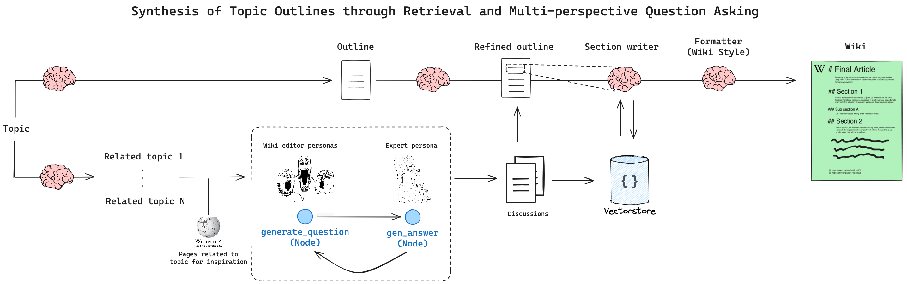

# STORM


## Overview
STORM is a writing system for synthesizing topic outlines through multi-perspective question asking based on trusted internet sources. STORM models the pre-writing stage by (1) discovering diverse perspectives, (2) simulating conversations where writers with different perspectives pose questions to a topic expert, and (3) curating the collected information to create an outline.

url : https://arxiv.org/abs/2402.14207

## Requirement
- WSL
- Python 3.10.2

## Useage
### pyenv
```
git clone
cd STORM
python -m venv venv
pip install -r requirements.txt
streamlit run app.py
```
## UI
ブラウザでurlを開くとこのような画面が表示される。
トピックを入力した後に実行を押すと、記事の生成が開始される。


生成された後に`Download PDF`ボタンを押すとPDFをダウンロードできる

## Example (generated article)
[pdf](example.pdf)

## Reference
https://github.com/langchain-ai/langgraph/blob/main/examples/storm/storm.ipynb
